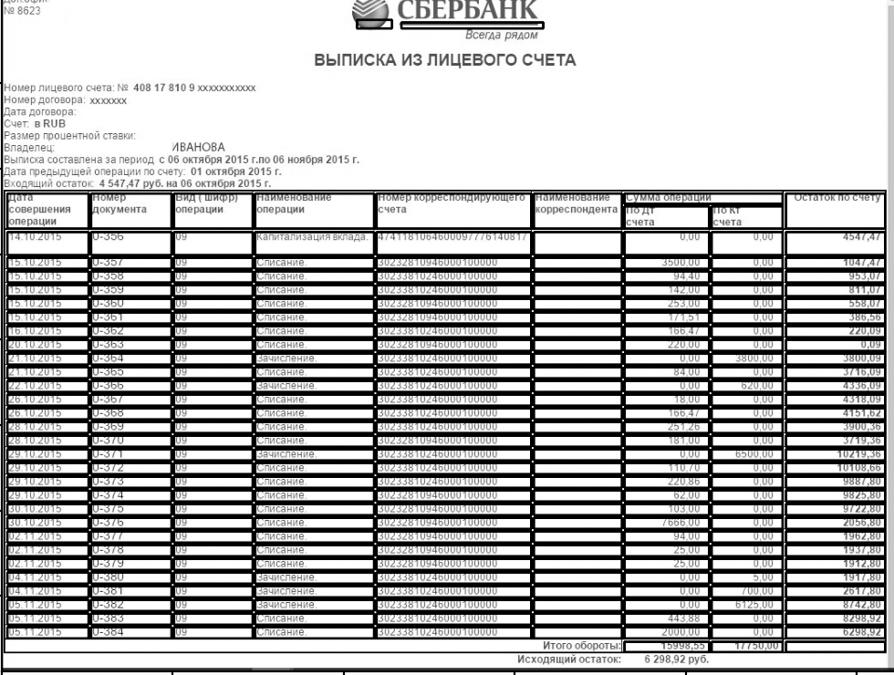

# Table recognition
Данный репозиторий содержит код, помогающий находить и извлекать табличные
данные из PDF-файла или изображения в формат xlsx.

### Requirements
В данной работе я использую:
- `Python` 3.7.6
- `numpy`        1.20.0
- `pandas` 1.0.1
- `pdf2image` 1.15.1
- `pytesseract` 0.3.7
- `opencv-python`            4.5.1.48
- `Pillow` 8.1.0
- `tesseract` 4.1.1

### Usage
Клонируем данный репозиторий к себе.  

`git clone https://github.com/Zaykka/table_recognition`

Через консоль запускаем файл `table-rec.py` с аргументом `путь_до_файла`. Тестовая выборка находится в папке `images`.

  Например, если мы хотим распознать таблицу в файле `images/Выписки_расписания/vypiska_1.jpeg`, открываем консоль, переходим в директорию с клонированным репозиторием и пишем:  

  `python table-rec.py images/Выписки_расписания/vypiska_1.jpeg`

По окончании работы алгоритма в той же директории появится файл .xlsx c таблицей.
### Overview

Алгоритм состоит из трех частей:
- Обнаружение таблиц и распознавание ячеек с помощью Open CV;
- Распределение ячеек по соответствующим строке и столбцу;
- Извлечение каждой выделенной ячейки с помощью оптического распознавания символов (OCR) с pytesseract.

Возьмем в качестве примера следующий файл(он находится в папке test_img):


Импортируем необходимые библиотеки.

```python
import sys
import cv2
import numpy as np
import pandas as pd
from PIL import Image
import pytesseract
```

Первым шагом прочитаем файл по его пути(указывается первым аргументом при запуске файла table-rec.py), используя пороговое значение для преобразования входного изображения в двоичное изображение и инвертируя его, чтобы получить черный фон и белые линии и шрифты.

``` python
def read_file(sample):
    read_image = cv2.imread(sample, 0)
    convert_bin,grey_scale = cv2.threshold(read_image,128,255,cv2.THRESH_BINARY | cv2.THRESH_OTSU)
    grey_scale = 255 - grey_scale
    return grey_scale, read_image
```


Следующим шагом определяем ядра для обнаружения прямоугольных блоков(табличной структуры). Сначала мы определяем длину ядра и далее вертикальные и горизонтальные ядра, чтобы обнаружить все вертикальные и все горизонтальные линии.

```python
def hor_ver_detect(read_image, grey_scale):
    length = np.array(read_image).shape[1]//100

    horizontal_kernel = cv2.getStructuringElement(cv2.MORPH_RECT, (length, 1))
    vertical_kernel = cv2.getStructuringElement(cv2.MORPH_RECT, (1, length))
    final = cv2.getStructuringElement(cv2.MORPH_RECT, (2, 2))
```

Следующим шагом является обнаружение горизонтальных линий.

```python
horizontal_detect = cv2.erode(grey_scale, horizontal_kernel, iterations=3)
hor_line = cv2.dilate(horizontal_detect, horizontal_kernel, iterations=3)
```


Тоже самое делаем для вертикальных.

```python
vertical_detect = cv2.erode(grey_scale, vertical_kernel, iterations=3)
ver_lines = cv2.dilate(vertical_detect, vertical_kernel, iterations=3)
```


Далее объединяем горизонтальные и вертикальные линии. Цель состоит в том, чтобы получить четкую табличную структуру для обнаружения каждой ячейки.

```python
combine = cv2.addWeighted(ver_lines, 0.5, hor_line, 0.5, 0.0)
combine = cv2.erode(~combine, final, iterations=2)
thresh, combine = cv2.threshold(combine,128,255, cv2.THRESH_BINARY | cv2.THRESH_OTSU)
convert_xor = cv2.bitwise_xor(read_image,combine)
inverse = cv2.bitwise_not(convert_xor)
return combine, inverse
```


После создания табличной структуры мы используем функцию findContours для обнаружения контуров. Это помогает нам получить точные координаты каждой ячейки.

```python
cont, _ = cv2.findContours(combine, cv2.RETR_TREE, cv2.CHAIN_APPROX_SIMPLE)
```

Следующая функция необходима для получения последовательности контуров и сортировки их сверху вниз.

```python
def get_boxes(num, method="left-to-right"):
    invert = False
    flag = 0
    if method == "right-to-left" or method == "bottom-to-top":
        invert = True
    if method == "top-to-bottom" or method == "bottom-to-top":
        flag = 1
    boxes = [cv2.boundingRect(c) for c in num]
    (num, boxes) = zip(*sorted(zip(num, boxes),
    key=lambda b:b[1][flag], reverse=invert))
    return (num, boxes)
```

Далее определяем правильное местоположение ячейки, то есть столбец и строку, где она находится. Во-первых, нам нужно получить высоту для каждой ячейки и сохранить ее в списке `dim`. Затем берем среднее значение высот. Следом получаем положение, ширину и высоту каждого контура и сохраняем их в списке `final_box`.

``` python
def contour_pos(boxes, cont, read_image):
    dim = [boxes[i][3] for i in range(len(boxes))]
    avg = np.mean(dim)

    final_box = []
    weidth = np.array(read_image).shape[1] // 2
    height = np.array(read_image).shape[0] // 10
    for c in cont:
        s1, s2, s3, s4 = cv2.boundingRect(c)
        if (s3 < weidth and s4 < height):
            final_box.append([s1,s2,s3,s4])

    return final_box, avg
```

В результате получаем такое изображение:



Теперь у нас есть каждая ячейка, ее расположение, высота и ширина, нам нужно найти правильное место в таблице. Следовательно, нам нужно знать, в какой строке и в каком столбце она находится. Пока ячейка не отличается больше, чем ее собственная (height + mean/2), она находится в той же строке. Как только разница в высоте превышает текущую (height + mean/2) начинается новая строка.

```python
def sort_boxes(final_box, avg):
    hor=[]
    ver=[]

    for i in range(len(final_box)):
        if i == 0:
            ver.append(final_box[i])
            last = final_box[i]
        else:
            if final_box[i][1] <= last[1] + avg/2:
                ver.append(final_box[i])
                last = final_box[i]
                if i == len(final_box) - 1:
                    hor.append(ver)
            else:
                hor.append(ver)
                ver=[]
                last = final_box[i]
                ver.append(final_box[i])
    total = mid = 0

    for i in range(len(hor)):
        t = len(hor[i])
        if t > total:
            total = t
        mid = [int(hor[i][j][0]+hor[i][j][2]/2) for j in range(len(hor[i])) if hor[0]]
    mid = np.array(mid)
    mid.sort()

    order = fin_order(hor, total, mid)
    return order, hor, total
```

На следующем шаге воспользуемся списком `order`. Мы берем каждую ячейку на основе изображения, подготавливаем ее для оптического распознавания символов. И далее при помомщи `pytesseract` распознаем содержащиеся в ней строки. Цикл проходит по каждой ячейке и сохраняет значение во внешнем списке.

```python
def extract_values(order, inverse):
    extract=[]
    for i in range(len(order)):
        for j in range(len(order[i])):
            inside=''
            if(len(order[i][j])==0):
                extract.append(' ')
            else:
                for k in range(len(order[i][j])):
                    side1,side2,width,height = order[i][j][k][0],order[i][j][k][1], order[i][j][k][2],order[i][j][k][3]
                    final_extract = inverse[side2:side2+height, side1:side1+width]
                    final_kernel = cv2.getStructuringElement(cv2.MORPH_RECT, (2, 1))
                    get_border = cv2.copyMakeBorder(final_extract,2,2,2,2, cv2.BORDER_CONSTANT,value=[255,255])
                    resize = cv2.resize(get_border, None, fx=2, fy=2, interpolation=cv2.INTER_CUBIC)
                    dil = cv2.dilate(resize, final_kernel,iterations=1)
                    ero = cv2.erode(dil, final_kernel,iterations=2)
                    ocr = pytesseract.image_to_string(ero, lang='rus')
                    if(len(ocr)==0):
                        ocr = pytesseract.image_to_string(ero, lang='rus')
                    inside = inside +" "+ ocr
                    inside = re.sub("\n", ' ', inside)
                    inside = re.sub(r'[\x00-\x08\x0b\x0c\x0e-\x1f\x7f-\xff\n]', ' ', inside)
                extract.append(inside)
    return extract
```

Последний шаг - преобразование списка в `DataFrame` и сохранение его в Excel-файле.

```python
def to_xlsx(extract, hor, total, f_name, n):
    a = np.array(extract)
    dataset = pd.DataFrame(a.reshape(len(hor), total))
    pos1 = f_name.rfind('/') + 1
    if pos1 == -1:
        pos1 = 0
    pos2 = f_name.rfind('.')
    f_name = f_name[pos1: pos2]
    if n == 0:
        with pd.ExcelWriter(f_name + '.xlsx', engine="openpyxl",
                        mode='w', sheet_name = n) as writer:
            dataset.to_excel(writer)
    else:
        with pd.ExcelWriter(f_name + '.xlsx', engine="openpyxl",
                        mode='a', sheet_name = n) as writer:
            dataset.to_excel(writer)
``
